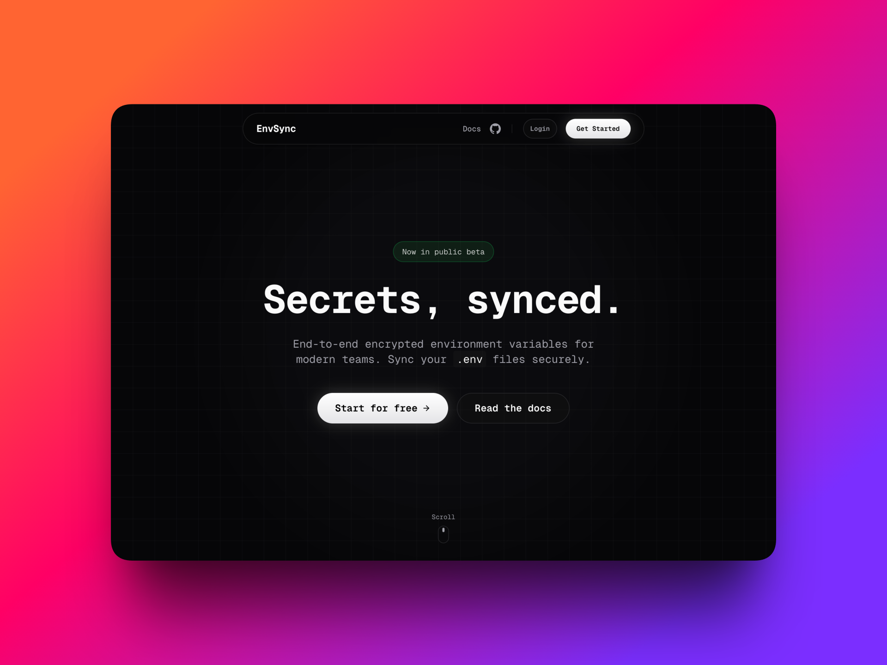

<div align="center">

<h1>EnvSync</h1>

End-to-end encrypted secrets management for development teams.
<br>
Sync your .env files across your team in under 100ms.

<br>

<div align="center">
  <a href="https://github.com/salmanabdellatif/EnvSync/stargazers">
    
  </a>
  <a href="https://www.npmjs.com/package/@envsync-labs/cli">
    
  </a>
  <a href="https://www.npmjs.com/package/@envsync-labs/cli">
    
  </a>
  <a href="https://github.com/salmanabdellatif/EnvSync/blob/main/LICENSE">
    
  </a>
</div>

<br>



</div>

---

## Why EnvSync?

- **End-to-End Encrypted:** Secrets are encrypted client-side using AES-256-GCM. The server never sees your raw keys.
- **Instant Sync:** Push from local, pull on production.
- **Team Ready:** Manage access controls and projects via the dashboard.

## Installation & Usage

```bash
# Install globally
npm install -g @envsync-labs/cli

# Login to your account
envsync login

# Link your current directory
envsync init

# Push your local .env
envsync push
```

## Tech Stack

- **Web**: Next.js 16, React 19, Tailwind CSS 4, shadcn/ui
- **API**: NestJS, Prisma, PostgreSQL, Passport
- **CLI**: Commander, Inquirer, Node.js
- **Security**: AES-256-GCM, RSA-2048

## Running Locally

```bash
# Install dependencies
pnpm install

# Setup environment
cp .env.example .env

# Start API
cd apps/api && pnpm run start:dev

# Start Web (in another terminal)
cd apps/web && pnpm run dev
```

## Project Structure

```
apps/
├── api/    # NestJS backend
├── web/    # Next.js frontend
└── cli/    # CLI tool
```
